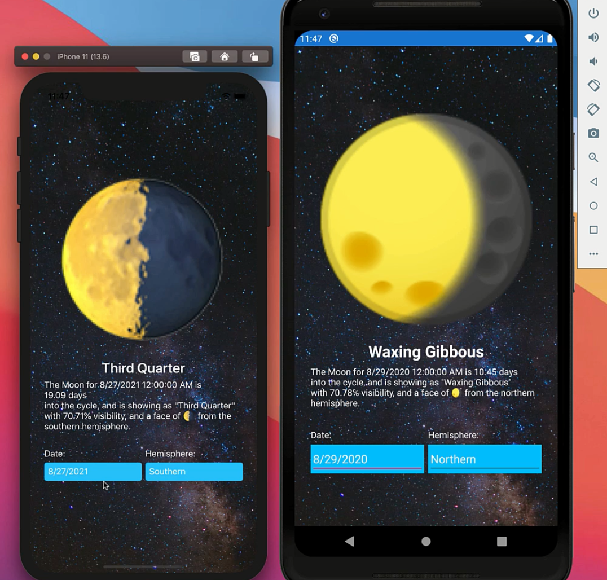

# Moon Phase App

## Description

This is a Xamarin Forms app that targets both Android and iOS. This demo was written entirely using [JetBrains Rider](https://jetbrains.com/rider) and on macOS. You can pick a `DateTime` using a DatePicker and the hemishpere (Northern, Southern) you are currently located in. You will be shown what the moon currently looks like and what the name of the moon is.

## Requirements

- JetBrains Rider (or some other IDE)
- Xamarin.Forms
- .NET Core 3.1+

